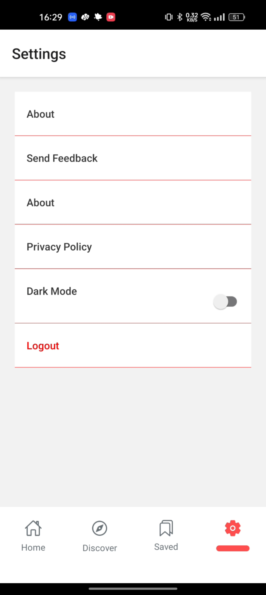

# 📰 React Native News App

A modern **React Native News Application** built with Expo. The app fetches real-time news from APIs, displays them in trending and category-based sections, and allows users to bookmark favorite articles for later reading.  

---

## 🚀 Features
- 📰 **Trending News Feed** with animated FlatList  
- 🔍 **Search by Category** for personalized browsing  
- 📑 **Bookmark & Save** favorite articles  
- 📱 **Responsive UI** for both Android & iOS  
- ⏱️ **Timestamps** with Moment.js for fresh updates  

---

## 🛠️ Tech Stack
- **React Native** (Expo)  
- **Axios** (API fetching)   
- **AsyncStorage** (Local storage for bookmarks)  
- **Moment.js** (Date & time formatting)  
- **Expo Linear Gradient** (UI enhancement)  
- **React Navigation** (Tab & stack navigation)  

---

## ⚡ Optimizations
- Efficient **API fetching with Axios** (caching & error handling).  
- Smooth animations using **FlatList optimizations**.  
- **Lazy loading of screens** for faster app startup.  
- **AsyncStorage caching** for offline bookmark support.  
- Clean & modular code structure for scalability.  

---
 

## 📸 Screenshots  

<p align="center">
  
  
  
  
</p>


---


## 📦 Installation  

1. Clone the repository  
   ```bash
   git clone https://github.com/P01Sensai/react-native-newsApp.git
   cd react-native-newsApp

2. **Install dependencies:**
   ```bash
   npm install
   # or
   yarn install

3. **Start the Expo development server:**
   ```bash
   npx expo start

4. **Run on your device or simulator:**

   📱 Use the Expo Go app on your Android/iOS device and scan the QR code.

   💻 Or run on an emulator/simulator from the Expo CLI menu.  


---

